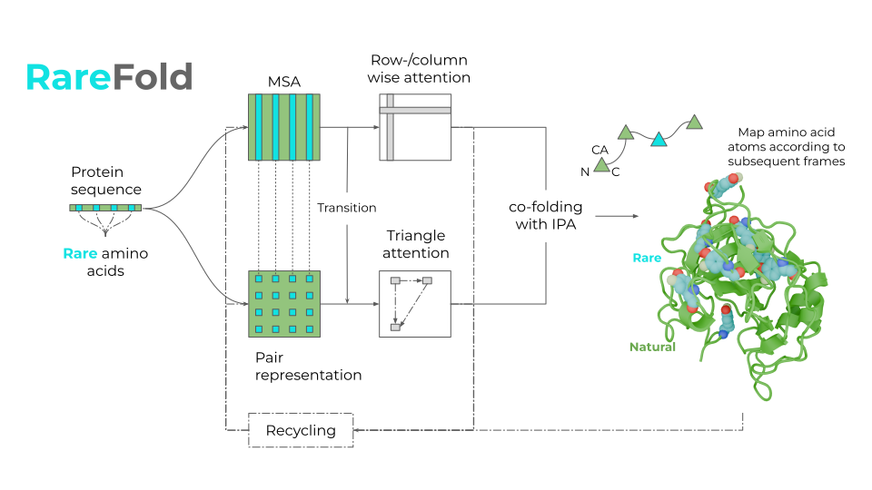

# RareFold
Structure prediction and design of proteins with noncanonical amino acids.

**RareFold** predicts single-chain protein structures containing **rare** noncanonical amino acids and enables the design of novel peptide binders through the EvoBindRare framework.

RareFold supports 49 different amino acid types.\
The 20 regular ones, and 29 **rare** ones:
MSE, TPO, MLY, CME, PTR, SEP,SAH, CSO, PCA, KCX, CAS, CSD, MLZ, OCS, ALY, CSS, CSX, HIC, HYP, YCM, YOF, M3L, PFF, CGU,FTR, LLP, CAF, CMH, MHO

**EvoBindRare** designs both linear and cyclic binders directly from a protein target sequence, no prior knowledge of binding sites is required (though optional). The framework enables rapid and flexible design with expanded chemical diversity through the incorporation of noncanonical amino acids. EvoBindRare has been experimentally validated for both linear and cyclic designs, achieving high-affinity binding in each case.

[Read more here](https://www.biorxiv.org/content/10.1101/2025.05.19.654846v1)



# LICENSE
RareFold is available under the [Apache License, Version 2.0](http://www.apache.org/licenses/LICENSE-2.0).  \
The RareFold parameters for prediction are made available under the terms of the [CC BY 4.0 license](https://creativecommons.org/licenses/by/4.0/legalcode). \
The design protocol EvoBindRare and the parameters for design are made available under the terms of the [CC BY-NC 4.0 license](https://creativecommons.org/licenses/by-nc/4.0/).

**You may not use these files except in compliance with the licenses.**

# Installation
## (several minutes)
The entire installation takes <1 hour on a standard computer. \
We assume you have CUDA12. For CUDA11, you will have to change the installation of some packages. \
The runtime will depend on the GPU you have available and the size of the protein you are predicting. \
On an NVIDIA A100 GPU, the prediction time is a few minutes on average.

First install miniconda, see: https://docs.conda.io/projects/miniconda/en/latest/miniconda-install.html or https://docs.conda.io/projects/miniconda/en/latest/miniconda-other-installer-links.html


```
bash install_dependencies.sh
```

1. Install the RareFold environment
2. Get the RareFold parameters for single-chain structure prediction
3. Get the EvoBindRare parameters for binder design
4. Get Uniclust for MSA search
5. Install HHblits for MSA search

# Predict using RareFold
Run the test case (a few minutes)
```
conda activate rarefold
bash predict.sh
```


# Design using EvoBindRare
## Design linear or cyclic peptide binders incorporating noncanonical amino acids
EvoBindRare designs novel peptide binders based only on a protein target sequence.
It is not necessary to specify any target residues within the protein sequence or the
length of the binder (although this is possible).
EvoBindRare is the only protocol with experimentally verified cyclic-noncanonical amino acid design capacity.

<p align="center">
  
&nbsp; &nbsp; &nbsp; &nbsp;
  
</p>

The target structure is shown in green, with canonical peptide residues in blue and noncanonical residues in magenta.

For the original version of EvoBind with regular amino acids, see: https://github.com/patrickbryant1/EvoBind

Run the test case
```
conda activate rarefold
bash design.sh
```


# Citation
If you use RareFold in your research, please cite

1. [Li Q, Daumiller D, Bryant P. RareFold: Structure prediction and design of proteins with noncanonical amino acids. bioRxiv. 2025. p. 2025.05.19.654846. doi:10.1101/2025.05.19.654846](https://www.biorxiv.org/content/10.1101/2025.05.19.654846v1)
