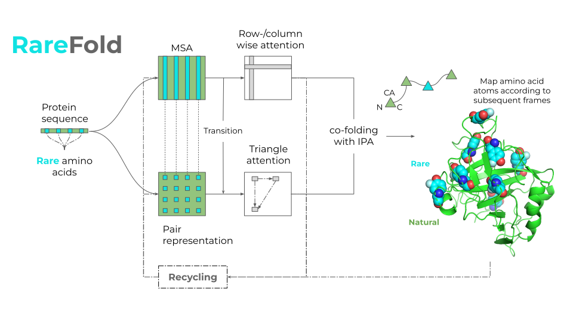

# RareFold
Structure prediction and design of proteins with noncanonical amino acids

# LICENSE

Prediction with RareFold - open
Design - noncommercial

# Installation
1. Get the RareFold parameters for single-chain structure prediction

2. Get the EvoBindRare parameters for binder design

3. Get Uniclust for MSA search

# Predict using the forward model

# Design linear or cyclic peptide binders with noncanonical amino acids
